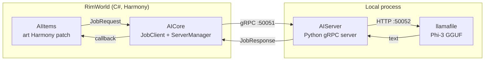

# RWAILib

**English** · [简体中文](README.zh-Hans.md) · [Русский](README.ru.md)

**Local, offline AI for RimWorld. No API keys, no cloud, no data leaving your machine.**

RWAILib is a framework that runs a small language model (Microsoft's [Phi-3](https://huggingface.co/microsoft/Phi-3-mini-4k-instruct)) entirely on your own computer and wires it into RimWorld. The first feature built on it rewrites the flavor text of in-game artwork with AI-generated titles and descriptions. The framework is designed so that more AI-driven features can be added over time.

It ships as two Steam Workshop mods backed by a self-contained Python AI server that the mod downloads and manages for you.

- **RimWorldAI Core**: the framework ([Steam Workshop](https://steamcommunity.com/sharedfiles/filedetails/?id=3269938006))
- **RimWorldAI Items**: AI artwork descriptions ([Steam Workshop](https://steamcommunity.com/sharedfiles/filedetails/?id=3269938552))

> Supported RimWorld version: **1.5** · Requires [Harmony](https://steamcommunity.com/sharedfiles/filedetails/?id=2009463077) · 27 in-game languages

---

## Features

- **Runs 100% locally.** The model runs on your hardware via [llamafile](https://github.com/Mozilla-Ocho/llamafile). Nothing is sent to any external API.
- **Zero-config setup.** No API keys. On first run the mod auto-downloads the runtime and a model sized to your GPU.
- **AI artwork descriptions.** Open any sculpture or artwork and its title and description are replaced with a freshly written one. Results are cached.
- **Hardware-aware model selection.** Picks a Phi-3 model size based on your available VRAM, or choose one yourself.
- **Localized.** Generates text in the language RimWorld is running in (27 supported).

## How it works

RWAILib is three cooperating pieces. The two C# mods run inside RimWorld; the Python server runs as a separate local process and is the only part that touches the model.



When you view a piece of art, AIItems' Harmony patch hashes it and submits a `JobRequest`. AICore's `JobClient` forwards it over gRPC to the Python server, which prompts the local Phi-3 model and returns a new title and description in a `JobResponse`. The result is cached so the model only runs once per item.

| Component | Language | Responsibility |
|-----------|----------|----------------|
| **AICore** | C# (Harmony) | The framework. Bootstraps, launches, and supervises the Python server; owns the gRPC channel; settings UI; model selection; auto-update. |
| **AIItems** | C# (Harmony) | Feature mod. Hooks `CompArt.GenerateImageDescription` to swap in AI text; caches results per item. Depends on AICore. |
| **AIServer** | Python 3.11 | gRPC server that drives a local llamafile/Phi-3 instance and generates the text. Distributed as a self-contained `.pyz`. |

The C#↔Python contract is a single gRPC service defined in [`AIServer/protos/job.proto`](AIServer/protos/job.proto) (mirrored in `AICore/Protos/`). It uses a `oneof` job payload so new job types can be added without breaking the wire format.

## Installation

Subscribe to both mods on the Steam Workshop and enable them (load **Harmony → Core → Items**):

1. [RimWorldAI Core](https://steamcommunity.com/sharedfiles/filedetails/?id=3269938006)
2. [RimWorldAI Items](https://steamcommunity.com/sharedfiles/filedetails/?id=3269938552)

On first launch, Core shows a welcome dialog where you pick a model size and confirm. It then downloads the runtime and model into `RWAI/` under your RimWorld config directory (e.g. `~/.config/RimWorld/RWAI/` on Linux). This is a one-time download.

### Requirements & model sizes

A GPU is strongly recommended. The model is chosen automatically from your VRAM, but you can override it in the mod settings:

| Size | Model | Download |
|------|-------|----------|
| **Mini** | Phi-3-mini-4k (Q4_K_M) | ~2.4 GB |
| **Small** | Phi-3-medium-128k (IQ2_XS) | ~4.1 GB |
| **Medium** | Phi-3-medium-128k (Q4_K_M) | ~8.6 GB |

Users in regions without HuggingFace access are served an equivalent model from [ModelScope](https://modelscope.cn) automatically based on the in-game language.

## Configuration

In-game mod settings (RimWorldAI Core):

- **Enable / disable** the AI service (starts/stops the local server).
- **Model size**: Mini / Small / Medium / Custom.
- **Check for updates on startup**: compares your installed server version against the latest GitHub release.

## Privacy

Everything runs locally. The only network access is the one-time download of the runtime and model (from GitHub, HuggingFace, or ModelScope) and the optional update check against the GitHub releases API. No game data or generated text is ever sent off your machine.

## Building from source

The repository uses git submodules for the three components.

### C# mods (AICore + AIItems)

Requires the [.NET SDK](https://dotnet.microsoft.com/en-us/download).

```sh
git clone --recurse-submodules https://github.com/igoforth/RWAILib.git
cd RWAILib
dotnet build -f net472 -c Release
```

Or via the [Cake](https://cakebuild.net/) script, which builds both projects in order:

```sh
dotnet cake          # builds AICore then AIItems
```

### AIServer (Python)

The server is packaged as a [PEP 441](https://peps.python.org/pep-0441/) `.pyz` zipapp that bundles a platform-specific Python interpreter and `grpcio`, so it runs without a system Python install. Build it with Python 3.11, `pdm`, and `pdm-packer`. See [`AIServer/README.md`](AIServer/README.md) for the full packaging steps (zipapp creation, translation compilation, and vendoring per-platform Python + wheels).

### Releases

GitHub Actions handle CI and distribution: `main.yml` builds the mods on every push, and `release.yml` packages and publishes a release when a `v*` tag is pushed. The mod fetches `AIServer.pyz` and `.version` from the latest release at runtime.

## Repository layout

```
RWAILib/
├── AICore/        # C# framework mod (submodule: RWAI_Core)
├── AIItems/       # C# artwork-description mod (submodule: RWAI_Items)
├── AIServer/      # Python gRPC server + llamafile driver (submodule: RWAI_Server)
├── bootstrap.py   # First-run downloader (curl, llamafile, server, model)
├── build.cake     # Cake build for the two C# mods
└── RWAILib.sln
```

## License

[MIT](LICENSE) © 2024 Ian Goforth

Author: **Trojan** · Discord `igoforth` · Steam `TrojanRL` · GitHub [`igoforth`](https://github.com/igoforth)
