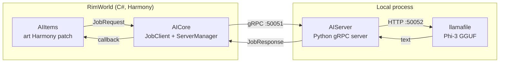

# RWAILib

[English](README.md) · [简体中文](README.zh-Hans.md) · **Русский**

**Локальный, автономный ИИ для RimWorld. Без API-ключей, без облака, без передачи ваших данных куда-либо.**

RWAILib — это фреймворк, который запускает небольшую языковую модель (Phi-3 от Microsoft, [Phi-3](https://huggingface.co/microsoft/Phi-3-mini-4k-instruct)) целиком на вашем собственном компьютере и интегрирует её в RimWorld. Первая построенная на нём функция переписывает художественный текст внутриигровых произведений искусства, генерируя названия и описания с помощью ИИ. Фреймворк спроектирован так, чтобы со временем можно было добавлять новые функции на основе ИИ.

Он поставляется в виде двух модов из Мастерской Steam, за которыми стоит самодостаточный Python-сервер ИИ; мод сам скачивает его и управляет им за вас.

- **RimWorldAI Core**: фреймворк ([Мастерская Steam](https://steamcommunity.com/sharedfiles/filedetails/?id=3269938006))
- **RimWorldAI Items**: описания произведений искусства от ИИ ([Мастерская Steam](https://steamcommunity.com/sharedfiles/filedetails/?id=3269938552))

> Поддерживаемая версия RimWorld: **1.5** · Требуется [Harmony](https://steamcommunity.com/sharedfiles/filedetails/?id=2009463077) · 27 внутриигровых языков

---

## Возможности

- **Работает на 100% локально.** Модель запускается на вашем оборудовании через [llamafile](https://github.com/Mozilla-Ocho/llamafile). Ничего не отправляется во внешние API.
- **Настройка без конфигурации.** Никаких API-ключей. При первом запуске мод автоматически скачивает среду выполнения и модель, подобранную под ваш GPU.
- **Описания произведений искусства от ИИ.** Откройте любую скульптуру или произведение искусства — его название и описание будут заменены свежесгенерированными. Результаты кэшируются.
- **Выбор модели под оборудование.** Размер модели Phi-3 подбирается исходя из доступной видеопамяти (VRAM), либо вы можете выбрать его сами.
- **Локализация.** Генерирует текст на том языке, на котором запущен RimWorld (поддерживается 27).

## Как это работает

RWAILib состоит из трёх взаимодействующих частей. Два мода на C# работают внутри RimWorld; Python-сервер работает как отдельный локальный процесс и является единственной частью, которая обращается к модели.



Когда вы просматриваете произведение искусства, Harmony-патч из AIItems вычисляет его хеш и отправляет `JobRequest`. `JobClient` из AICore пересылает его по gRPC на Python-сервер, который обращается к локальной модели Phi-3 и возвращает новое название и описание в `JobResponse`. Результат кэшируется, поэтому модель запускается лишь один раз для каждого предмета.

| Компонент | Язык | Назначение |
|-----------|------|------------|
| **AICore** | C# (Harmony) | Фреймворк. Инициализирует, запускает и контролирует Python-сервер; владеет каналом gRPC; интерфейс настроек; выбор модели; автообновление. |
| **AIItems** | C# (Harmony) | Функциональный мод. Перехватывает `CompArt.GenerateImageDescription`, чтобы подставить текст от ИИ; кэширует результаты по предметам. Зависит от AICore. |
| **AIServer** | Python 3.11 | gRPC-сервер, который управляет локальным экземпляром llamafile/Phi-3 и генерирует текст. Распространяется как самодостаточный `.pyz`. |

Контракт между C# и Python — это единственный gRPC-сервис, определённый в [`AIServer/protos/job.proto`](AIServer/protos/job.proto) (продублирован в `AICore/Protos/`). Он использует полезную нагрузку `oneof`, поэтому новые типы заданий можно добавлять, не нарушая формат передачи данных.

## Установка

Подпишитесь на оба мода в Мастерской Steam и включите их (порядок загрузки: **Harmony → Core → Items**):

1. [RimWorldAI Core](https://steamcommunity.com/sharedfiles/filedetails/?id=3269938006)
2. [RimWorldAI Items](https://steamcommunity.com/sharedfiles/filedetails/?id=3269938552)

При первом запуске Core покажет приветственное окно, где вы выберете размер модели и подтвердите выбор. Затем он скачает среду выполнения и модель в папку `RWAI/` внутри вашего каталога настроек RimWorld (например, `~/.config/RimWorld/RWAI/` в Linux). Это однократная загрузка.

### Требования и размеры моделей

Настоятельно рекомендуется GPU. Модель выбирается автоматически по объёму видеопамяти, но вы можете переопределить её в настройках мода:

| Размер | Модель | Загрузка |
|--------|--------|----------|
| **Mini** | Phi-3-mini-4k (Q4_K_M) | ~2,4 ГБ |
| **Small** | Phi-3-medium-128k (IQ2_XS) | ~4,1 ГБ |
| **Medium** | Phi-3-medium-128k (Q4_K_M) | ~8,6 ГБ |

Пользователям в регионах без доступа к HuggingFace эквивалентная модель автоматически предоставляется с [ModelScope](https://modelscope.cn) в зависимости от внутриигрового языка.

## Конфигурация

Внутриигровые настройки мода (RimWorldAI Core):

- **Включить / отключить** сервис ИИ (запускает/останавливает локальный сервер).
- **Размер модели**: Mini / Small / Medium / Custom.
- **Проверять обновления при запуске**: сравнивает установленную версию сервера с последним релизом на GitHub.

## Конфиденциальность

Всё работает локально. Единственный сетевой доступ — это однократная загрузка среды выполнения и модели (с GitHub, HuggingFace или ModelScope) и необязательная проверка обновлений через API релизов GitHub. Никакие игровые данные или сгенерированный текст никогда не покидают ваш компьютер.

## Сборка из исходного кода

В репозитории используются подмодули git для трёх компонентов.

### Моды на C# (AICore + AIItems)

Требуется [.NET SDK](https://dotnet.microsoft.com/en-us/download).

```sh
git clone --recurse-submodules https://github.com/igoforth/RWAILib.git
cd RWAILib
dotnet build -f net472 -c Release
```

Либо через скрипт [Cake](https://cakebuild.net/), который собирает оба проекта по порядку:

```sh
dotnet cake          # сначала собирает AICore, затем AIItems
```

### AIServer (Python)

Сервер упакован как zipapp [PEP 441](https://peps.python.org/pep-0441/) `.pyz`, который содержит платформозависимый интерпретатор Python и `grpcio`, поэтому работает без установленного в системе Python. Соберите его с помощью Python 3.11, `pdm` и `pdm-packer`. Полные шаги упаковки (создание zipapp, компиляция переводов и вендоринг Python и wheel-пакетов под каждую платформу) см. в [`AIServer/README.md`](AIServer/README.md).

### Релизы

GitHub Actions отвечают за CI и распространение: `main.yml` собирает моды при каждом push, а `release.yml` упаковывает и публикует релиз при push тега `v*`. Во время работы мод получает `AIServer.pyz` и `.version` из последнего релиза.

## Структура репозитория

```
RWAILib/
├── AICore/        # Мод-фреймворк на C# (подмодуль: RWAI_Core)
├── AIItems/       # Мод описаний произведений искусства на C# (подмодуль: RWAI_Items)
├── AIServer/      # gRPC-сервер на Python + драйвер llamafile (подмодуль: RWAI_Server)
├── bootstrap.py   # Загрузчик при первом запуске (curl, llamafile, сервер, модель)
├── build.cake     # Сборка Cake для двух модов на C#
└── RWAILib.sln
```

## Лицензия

[MIT](LICENSE) © 2024 Ian Goforth

Автор: **Trojan** · Discord `igoforth` · Steam `TrojanRL` · GitHub [`igoforth`](https://github.com/igoforth)
