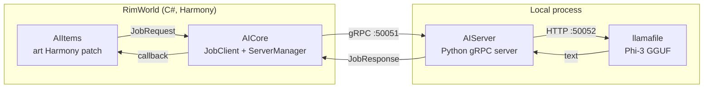

# RWAILib

[English](README.md) · **简体中文** · [Русский](README.ru.md)

**为 RimWorld 提供本地、离线的 AI。无需 API 密钥，无需云端，数据不会离开你的电脑。**

RWAILib 是一个框架，它在你自己的电脑上完整运行一个小型语言模型（微软的 [Phi-3](https://huggingface.co/microsoft/Phi-3-mini-4k-instruct)），并将其接入 RimWorld。基于该框架构建的第一个功能，会用 AI 生成的标题和描述来重写游戏内艺术品的风味文本。框架的设计便于日后逐步加入更多由 AI 驱动的功能。

它以两个创意工坊（Steam Workshop）模组的形式发布，背后由一个自包含的 Python AI 服务器支撑，该服务器由模组为你自动下载和管理。

- **RimWorldAI Core**：框架本体（[创意工坊](https://steamcommunity.com/sharedfiles/filedetails/?id=3269938006)）
- **RimWorldAI Items**：AI 艺术品描述（[创意工坊](https://steamcommunity.com/sharedfiles/filedetails/?id=3269938552)）

> 支持的 RimWorld 版本：**1.5** · 需要 [Harmony](https://steamcommunity.com/sharedfiles/filedetails/?id=2009463077) · 支持 27 种游戏内语言

---

## 功能特性

- **完全本地运行。** 模型通过 [llamafile](https://github.com/Mozilla-Ocho/llamafile) 在你的硬件上运行。不会向任何外部 API 发送数据。
- **零配置安装。** 无需 API 密钥。首次运行时，模组会自动下载运行时和一个与你的 GPU 相匹配的模型。
- **AI 艺术品描述。** 打开任意雕塑或艺术品，其标题和描述会被替换为全新撰写的内容。结果会被缓存。
- **按硬件选择模型。** 根据你的可用显存（VRAM）选择 Phi-3 模型尺寸，你也可以自行指定。
- **多语言本地化。** 以 RimWorld 当前运行的语言生成文本（支持 27 种）。

## 工作原理

RWAILib 由三个协同工作的部分组成。两个 C# 模组运行在 RimWorld 内部；Python 服务器作为独立的本地进程运行，是唯一直接与模型交互的部分。



当你查看一件艺术品时，AIItems 的 Harmony 补丁会对其计算哈希并提交一个 `JobRequest`。AICore 的 `JobClient` 通过 gRPC 将其转发给 Python 服务器，服务器随即对本地的 Phi-3 模型发起提示，并在 `JobResponse` 中返回新的标题和描述。结果会被缓存，因此每件物品只会运行一次模型。

| 组件 | 语言 | 职责 |
|------|------|------|
| **AICore** | C#（Harmony） | 框架本体。引导、启动并监管 Python 服务器；持有 gRPC 通道；设置界面；模型选择；自动更新。 |
| **AIItems** | C#（Harmony） | 功能模组。挂钩 `CompArt.GenerateImageDescription` 以替换为 AI 文本；按物品缓存结果。依赖 AICore。 |
| **AIServer** | Python 3.11 | 驱动本地 llamafile/Phi-3 实例并生成文本的 gRPC 服务器。以自包含的 `.pyz` 形式分发。 |

C# 与 Python 之间的契约是一个 gRPC 服务，定义在 [`AIServer/protos/job.proto`](AIServer/protos/job.proto) 中（并在 `AICore/Protos/` 中镜像）。它使用 `oneof` 任务载荷，因此可以在不破坏通信格式的前提下新增任务类型。

## 安装

在创意工坊订阅这两个模组并启用它们（加载顺序为 **Harmony → Core → Items**）：

1. [RimWorldAI Core](https://steamcommunity.com/sharedfiles/filedetails/?id=3269938006)
2. [RimWorldAI Items](https://steamcommunity.com/sharedfiles/filedetails/?id=3269938552)

首次启动时，Core 会弹出一个欢迎对话框，让你选择模型尺寸并确认。随后它会将运行时和模型下载到你的 RimWorld 配置目录下的 `RWAI/` 文件夹中（例如在 Linux 上为 `~/.config/RimWorld/RWAI/`）。这是一次性下载。

### 系统要求与模型尺寸

强烈建议使用 GPU。模型会根据你的显存自动选择，但你也可以在模组设置中覆盖：

| 尺寸 | 模型 | 下载大小 |
|------|------|----------|
| **Mini** | Phi-3-mini-4k (Q4_K_M) | 约 2.4 GB |
| **Small** | Phi-3-medium-128k (IQ2_XS) | 约 4.1 GB |
| **Medium** | Phi-3-medium-128k (Q4_K_M) | 约 8.6 GB |

对于无法访问 HuggingFace 的地区，会根据游戏内语言自动从 [ModelScope（魔搭）](https://modelscope.cn) 提供一个等效的模型。

## 配置

游戏内模组设置（RimWorldAI Core）：

- **启用 / 禁用** AI 服务（启动/停止本地服务器）。
- **模型尺寸**：Mini / Small / Medium / Custom。
- **启动时检查更新**：将你已安装的服务器版本与最新的 GitHub 发行版进行比较。

## 隐私

一切都在本地运行。唯一的网络访问是一次性下载运行时和模型（来自 GitHub、HuggingFace 或 ModelScope），以及可选的针对 GitHub releases API 的更新检查。任何游戏数据或生成的文本都不会离开你的电脑。

## 从源码构建

本仓库使用 git 子模块管理这三个组件。

### C# 模组（AICore + AIItems）

需要 [.NET SDK](https://dotnet.microsoft.com/en-us/download)。

```sh
git clone --recurse-submodules https://github.com/igoforth/RWAILib.git
cd RWAILib
dotnet build -f net472 -c Release
```

或使用 [Cake](https://cakebuild.net/) 脚本，它会按顺序构建两个项目：

```sh
dotnet cake          # 先构建 AICore，再构建 AIItems
```

### AIServer（Python）

服务器被打包为一个 [PEP 441](https://peps.python.org/pep-0441/) `.pyz` zipapp，其中捆绑了特定平台的 Python 解释器和 `grpcio`，因此无需安装系统级 Python 即可运行。使用 Python 3.11、`pdm` 和 `pdm-packer` 进行构建。完整的打包步骤（zipapp 创建、翻译编译，以及按平台打包 Python 与 wheel）请参见 [`AIServer/README.md`](AIServer/README.md)。

### 发行

GitHub Actions 负责 CI 与分发：`main.yml` 在每次推送时构建模组，`release.yml` 在推送 `v*` 标签时打包并发布一个 release。模组会在运行时从最新的 release 中获取 `AIServer.pyz` 和 `.version`。

## 仓库结构

```
RWAILib/
├── AICore/        # C# 框架模组（子模块：RWAI_Core）
├── AIItems/       # C# 艺术品描述模组（子模块：RWAI_Items）
├── AIServer/      # Python gRPC 服务器 + llamafile 驱动（子模块：RWAI_Server）
├── bootstrap.py   # 首次运行下载器（curl、llamafile、服务器、模型）
├── build.cake     # 两个 C# 模组的 Cake 构建脚本
└── RWAILib.sln
```

## 许可证

[MIT](LICENSE) © 2024 Ian Goforth

作者：**Trojan** · Discord `igoforth` · Steam `TrojanRL` · GitHub [`igoforth`](https://github.com/igoforth)
